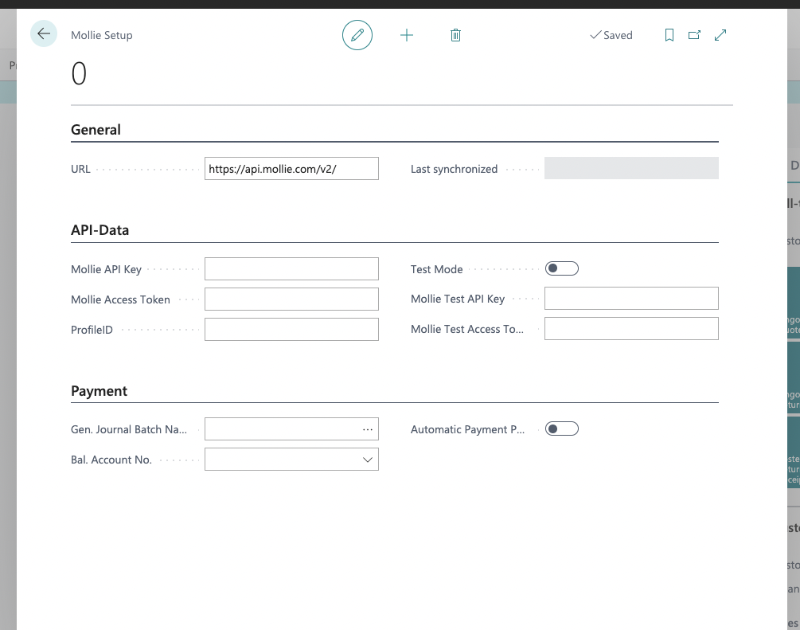
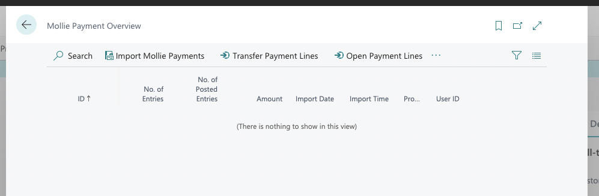
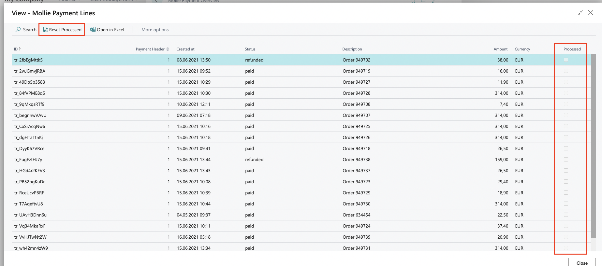
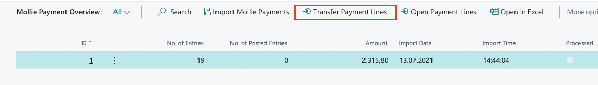
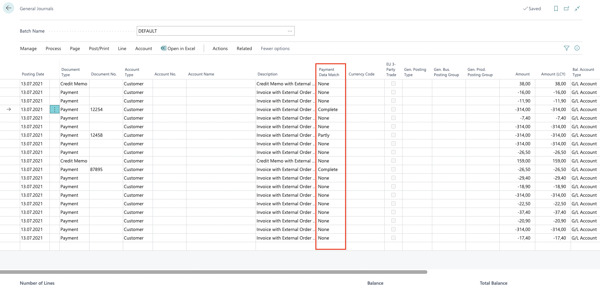

# **Mollie Connector Documentation**
## **What is the Mollie Connector?**

The Mollie Connector is an extension to request and process payment data received from the payment provider Mollie.

 

## **New Objects**

In order to use the basic functionality - data exchange with Mollie - the necessary API data must be filled in the Mollie setup.

 

 

Furthermore, process-relevant information can be filled in the Payment area. 
The "Test mode" field is only intended for the use of Mollie test data. The button "Automatic Payment Processing" can be activated to process complete payments directly.

To start the import and further processing of the payment data, the "Mollie Payment Overview" page has also been integrated.

 

 

This page contains the following action buttons:

1. Import Mollie Payments

    This button requests paid and credited payments from Mollie and creates one payment row per payment. Each import is represented with a new row in the payment overview.

2. Transfer Payment Lines
    
    This button checks the imported payment lines, searches for related invoices (using the external document number from Mollie) and transfers them to a general journal, defined in the Mollie setup.

3. Open Payment Lines

    This button opens a new overview page that displays more information about the related payment information of the import.

 

 

The Mollie payment line page displays in detail all the payment information received from Mollie. It also offers the function to reinsert already received payments into the general journal by clicking on the "Reset processed" button.

 

## **Invoice assignment**

After importing the payment data from Mollie, the "Transfer Payment Lines" button on the "Mollie Payment Overview" page must be pressed. This takes over all payment lines that are not marked as "Processed" into a general journal. If possible the corresponding invoices will be assigned, via "External Order No.".

 

 

The next step is to open the general journal defined in the Mollie setup. It now contains all the imported payments and credit memos.

 

 

A new field "Payment data match" indicates whether a Business Central document could be assigned and whether the amounts match.

The Payment Data Match field can contain the following values:

- Complete 
    
    The document was found and the amounts are within an acceptable tolerance range - This row can be posted directly.
- Partial 

    The document was found, but the amount variance is no longer within the tolerance range - This line must be cross-checked again so that the discrepancies can be resolved. The amount of the amount discrepancy is indicated in the Description field.
- No match 

    The document could not be found via the External document number - The Description field specifies the External document number that was not found in Business Central.

 

## **Process payments**

Payment lines that are marked as "Complete" in the General Journal can be processed directly or will be automatically processed if the button "Automatic Payment Processing" in the Mollie setup is activated.

All other lines have to be cross-checked and edited again.

